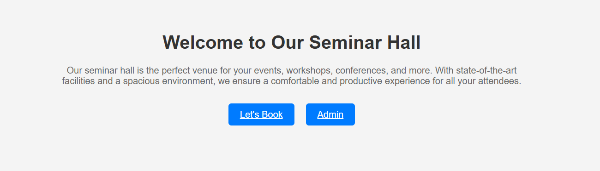

# Auditorium Booking System



## Overview

The Auditorium Booking System is a web-based platform that allows administrators to create and manage events. Users can log in to view upcoming events and register for them. The system is developed using HTML, CSS, JavaScript, and PHP, with XAMPP as the required local server environment.

UNZip the audi-booking

## Features

### Admin Features:

- Secure login and authentication
- Create, update, and delete events
- Manage user registrations for events

### User Features:

- Register and log in to the system
- View upcoming events upon login
- Register for available events
- View their registered events

## Technology Stack

- **Frontend:** HTML, CSS, JavaScript
- **Backend:** PHP
- **Database:** MySQL (via XAMPP)
- **Server:** Apache (via XAMPP)

## Installation and Setup

### Prerequisites:

1. Install **XAMPP** from [Apache Friends](https://www.apachefriends.org/)
2. Start **Apache** and **MySQL** from the XAMPP Control Panel

### Steps:

1. Clone or download the project files and place them inside the `htdocs` folder of XAMPP.
2. Open **phpMyAdmin** ([http://localhost/phpmyadmin/](http://localhost/phpmyadmin/))
3. Create a database named `auditorium_booking`.
4. Import the provided `database.sql` file into the newly created database.
5. Configure database credentials in `config.php`:
   ```php
   <?php
   $servername = "localhost";
   $username = "root";
   $password = "";
   $dbname = "auditorium_booking";
   ?>
   ```
6. Open the browser and navigate to `http://localhost/auditorium_booking/`

## Usage

### Admin:

1. Log in using admin credentials.
2. Create events by filling in event details.
3. Manage event registrations.

### User:

1. Register and log in.
2. Browse upcoming events.
3. Register for an event.
4. View registered events.

## Folder Structure

```
/auditorium_booking
|-- index.php
|-- login.php
|-- register.php
|-- dashboard.php
|-- admin/
|   |-- create_event.php
|   |-- manage_events.php
|-- assets/
|   |-- css/
|   |-- js/
|-- database.sql
|-- config.php
```

## Future Enhancements

- Implement email notifications for event registration.
- Add a calendar view for event scheduling.
- Improve UI/UX for better user experience.

## License

This project is open-source and available for modification and distribution.

